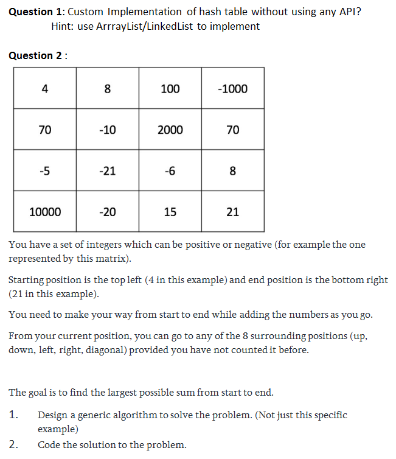

# ServiceNow

Here, to demonstrate my abilities and to come up with solutions that are not just quick an dirty algorithms, but to take the opportunity to show implementations that leverage design patterns, principles of OOP, and SOLID principles.

## Programming Exercise 1, Hashtables

Could be a little overkill in design and architecture for algorithm questions but wanted to use the opportunity to highlight design and architecture abilities.

The hashtable solution demonstrates modularity by separating concerns, in how bucket collections and buckets are each swappable interfaces with multiple implementations with a facade pattern to bring the pieces together into concrete hashtable implementations with a factory to create the bucket internals from these bucket interface implementations in valid combinations.

There are two implementations of the hashtable, a simple implementation with a fixed bucket collection size and items' keys are hashed into buckets using a swappable interface implementation IHashGenerator and collisions are handled by a bucket's ability to hold more that one item IMultiiItemBucket and then sort out the one requested though another swappable interface that determines key equality.

Second implementation is a complex hashtable that has a growing bucket collection because this implementation has bucket which hold only one item.  Collisions here are handled by a algorithm of bucket index skipping and key comparisons, all swappable implementations again.  This implementation uses some optimized algorithms for item placement that were researched.  A fill factor helps to determine when to resize and rehash the items into the resized table, and optimal prime number are used for the sizes of the bucket collection.

Each impementation's internals (bucket collections and buckets) are built by a factory to make sure compatible types are used together.

By going to this extreme I hope to also show this was not just answers looked up on google.  There would be nothing else out there like this.

## Programming Exercise 2, Grid board

After reading the question it can be quickly determined this is a graph structure. In each Node of the graph/tree structure there is a linked list of pointers to nodes which are the node's neighbors in up to 8 directions if they exist in the tabular layout.

Based on the requirements a Node within the graph will also need to keep track of when it has been visited and the value of the node.  As well, the start and end nodes must be defined in the graph so that the graph can be traversed.  This was left up to the implementation; instead of always starting at top left and ending in bottom right, the the start and end nodes are selectible by the graph adapter.

The necessary algorithm becomes an implementation of Longest Path in a Directed Acyclic Graph and again took I the opportunity to implement some design patterns, in an adpater pattern to turn a Grid into a Graph, that is also proxy pattern to defer building the graph structure until requested, and also to cache that build Graph within the adapter.

Careful readers may notice the algorithm complexity due to requirements would not conform to a dp-solvable situation such as with djikstra or bellman-ford approaches.  So the closest linear time solution is only going to be an approximation.  The accurate solution can really only be attained in polynomial time complexity which increases exponentially as the grid dimensions grows.  This brute force solution is also included but becomes unusable due to complexity constrainst at nominal test case sizes such as in 8x8 complexity.

## Original Questions

